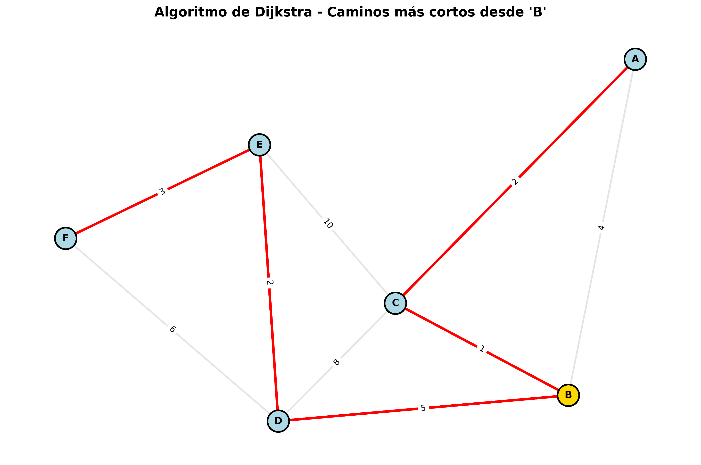
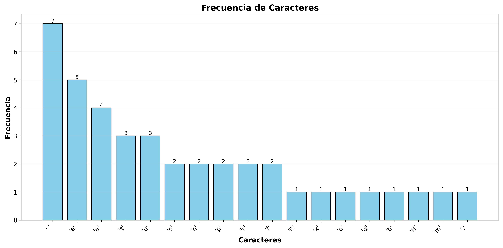

# Proyecto Final - Análisis de Algoritmos
## Implementación y Visualización de Algoritmos Avanzados

---

# Universidad Da Vinci de Guatemala


---

## Información del Proyecto

| Campo | Información |
|-------|-------------|
| **Universidad** | Universidad Da Vinci de Guatemala |
| **Facultad** | Ingeniería Industria y Tecnología |
| **Curso** | Análisis de Algoritmos |
| **Docente** | Ing. César Sazo |
| **Estudiante** | William Estuardo Cardona Mateo |
| **Carnet** | 202304221 |
| **Fecha** | 22/11/2025 |

---

## Objetivos

### Objetivo General
Desarrollar un proyecto integral que implemente, analice y visualice los algoritmos Prim, Kruskal, Dijkstra y Huffman, utilizando archivos externos para la entrada de datos, generando imágenes PNG como evidencia del procesamiento y aplicando un flujo profesional de trabajo basado en Gitflow.

### Objetivos Específicos
- Implementar de forma modular los algoritmos Prim, Kruskal, Dijkstra y Huffman
- Leer grafos desde archivos CSV y textos desde archivos TXT
- Generar gráficos PNG como salida visual obligatoria
- Documentar el proyecto de manera profesional utilizando README.md
- Aplicar Gitflow con ramas, PRs, merges, tags y organización adecuada
- Explicar la complejidad teórica de cada algoritmo

---

## Marco Teórico

### 1. Algoritmo de Prim

<details>
<summary><b>Ver detalles del algoritmo</b></summary>

El **Algoritmo de Prim** es un algoritmo greedy utilizado para encontrar el Árbol de Expansión Mínima (Minimum Spanning Tree - MST) en un grafo conexo, no dirigido y ponderado.

#### Funcionamiento
1. Inicia con un vértice arbitrario
2. En cada iteración, agrega la arista de menor peso que conecta el árbol en construcción con un vértice no visitado
3. Repite hasta que todos los vértices estén incluidos

#### Aplicaciones
- Diseño de redes de telecomunicaciones
- Planificación de redes eléctricas
- Diseño de circuitos integrados
- Optimización de rutas de distribución

#### Pseudocódigo
```
función Prim(Grafo G, Vértice origen):
    MST = conjunto vacío
    visitados = {origen}
    heap = aristas adyacentes a origen
    
    mientras heap no esté vacío Y visitados < V:
        arista = extraer arista de menor peso de heap
        si destino no está en visitados:
            agregar arista a MST
            agregar destino a visitados
            agregar aristas adyacentes a destino a heap
    
    retornar MST
```

</details>

**Complejidad Temporal:** `O(E log V)` usando heap binario

---

### 2. Algoritmo de Kruskal

<details>
<summary><b>Ver detalles del algoritmo</b></summary>

El **Algoritmo de Kruskal** es otro algoritmo greedy para encontrar el MST, pero utiliza un enfoque diferente basado en ordenar las aristas.

#### Funcionamiento
1. Ordena todas las aristas por peso ascendente
2. Itera sobre las aristas ordenadas
3. Agrega cada arista al MST si no forma un ciclo (usando Union-Find)
4. Termina cuando tiene V-1 aristas

#### Estructura Union-Find
La estructura **Union-Find** (Disjoint Set Union) permite:
- **Find:** Encontrar el representante de un conjunto - `O(α(n))`
- **Union:** Unir dos conjuntos - `O(α(n))`
- **Compresión de ruta:** Optimización que aplana el árbol
- **Unión por rango:** Optimización que une por altura

#### Aplicaciones
- Clustering de datos
- Segmentación de imágenes
- Redes de transporte
- Análisis de conectividad

</details>

**Complejidad Temporal:** `O(E log E)` dominado por el ordenamiento

---

### 3. Algoritmo de Dijkstra

<details>
<summary><b>Ver detalles del algoritmo</b></summary>

El **Algoritmo de Dijkstra** encuentra los caminos más cortos desde un vértice origen a todos los demás vértices en un grafo con pesos no negativos.

#### Funcionamiento
1. Inicializa las distancias: 0 para el origen, ∞ para los demás
2. Usa una cola de prioridad (heap) con los vértices
3. En cada iteración, extrae el vértice con menor distancia
4. Actualiza las distancias de sus vecinos (relajación)
5. Repite hasta procesar todos los vértices

#### Aplicaciones
- Sistemas de navegación GPS
- Enrutamiento de paquetes en redes
- Planificación de rutas de transporte
- Sistemas de recomendación

#### Limitaciones
- NO funciona con pesos negativos
- Para pesos negativos usar Bellman-Ford

</details>

**Complejidad Temporal:** `O((V + E) log V)` con heap binario

---

### 4. Algoritmo de Huffman

<details>
<summary><b>Ver detalles del algoritmo</b></summary>

El **Algoritmo de Huffman** construye un código de prefijo óptimo para comprimir datos basándose en la frecuencia de los caracteres.

#### Funcionamiento
1. Calcula la frecuencia de cada carácter
2. Crea nodos hoja para cada carácter
3. Construye un árbol binario:
   - Combina los dos nodos de menor frecuencia
   - Crea un nodo padre con la suma de frecuencias
   - Repite hasta tener un solo árbol
4. Asigna códigos: 0 para rama izquierda, 1 para derecha

#### Propiedades
- Códigos más cortos para caracteres frecuentes
- Código de prefijo: ningún código es prefijo de otro
- Compresión sin pérdida
- Óptimo para codificación por símbolos

#### Aplicaciones
- Compresión de archivos (ZIP, GZIP)
- Compresión de imágenes (JPEG)
- Transmisión de datos
- Protocolos de comunicación

</details>

**Complejidad Temporal:** `O(n log n)` donde n = caracteres únicos

---

## Tabla Comparativa de Complejidades

| Algoritmo | Complejidad Temporal | Complejidad Espacial | Estructura de Datos Principal |
|-----------|---------------------|---------------------|-------------------------------|
| **Prim** | O(E log V) | O(V + E) | Heap binario + Lista de adyacencia |
| **Kruskal** | O(E log E) | O(V + E) | Union-Find + Ordenamiento |
| **Dijkstra** | O((V + E) log V) | O(V + E) | Heap binario + Lista de adyacencia |
| **Huffman** | O(n log n) | O(n) | Heap binario + Árbol binario |

**Notación:**
- `V` = Número de vértices
- `E` = Número de aristas
- `n` = Número de caracteres únicos (Huffman)

---

## Estructura del Proyecto
```
proyecto-algoritmos-avanzados/
├── src/
│   ├── __init__.py          # Inicialización del paquete
│   ├── graph_utils.py       # Utilidades para grafos
│   ├── prim.py              # Algoritmo de Prim
│   ├── kruskal.py           # Algoritmo de Kruskal
│   ├── dijkstra.py          # Algoritmo de Dijkstra
│   └── huffman.py           # Algoritmo de Huffman
├── data/
│   ├── grafo.csv            # Archivo de entrada para grafos
│   └── texto.txt            # Archivo de entrada para Huffman
├── output/
│   ├── prim_mst.png         # Salida de Prim
│   ├── kruskal_mst.png      # Salida de Kruskal
│   ├── dijkstra_paths.png   # Salida de Dijkstra
│   ├── huffman_tree.png     # Árbol de Huffman
│   └── huffman_freq.png     # Frecuencias de Huffman
├── docs/
│   └── evidencias/          # Capturas de pantalla y evidencias
├── main.py                  # Programa principal con menú
├── requirements.txt         # Dependencias del proyecto
├── .gitignore              # Archivos ignorados por Git
└── README.md               # Este archivo
```

---

## Formato de Entrada

### Archivo de Grafo (CSV)

**Formato:** `nodo1,nodo2,peso`
```csv
A,B,4
A,C,2
B,C,1
B,D,5
C,D,8
C,E,10
D,E,2
D,F,6
E,F,3
```

**Características:**
- Grafo no dirigido
- Pesos positivos enteros
- Sin encabezados
- Formato: `origen,destino,peso`

### Archivo de Texto (TXT)
```
Este es un texto de prueba para el algoritmo de Huffman.
La compresion de datos es fundamental en ciencias de la computacion.
Huffman proporciona una codificacion optima basada en frecuencias.
```

**Características:**
- Cualquier texto en UTF-8
- Se analizan todos los caracteres (incluyendo espacios y saltos de línea)

---

## Instalación y Ejecución

### Prerrequisitos

- **Python 3.11** o superior
- **pip** (gestor de paquetes)
- **Git**
- **Graphviz** (opcional, para mejores visualizaciones)

### Instalación Paso a Paso

1. **Clonar el repositorio:**
```bash
git clone https://github.com/Cardonagt/proyecto-algoritmos-avanzados.git
cd proyecto-algoritmos-avanzados
```

2. **Crear entorno virtual:**
```bash
python -m venv venv
```

3. **Activar entorno virtual:**
```bash
# Windows (PowerShell):
venv\Scripts\Activate.ps1

# Windows (CMD):
venv\Scripts\activate.bat

# Mac/Linux:
source venv/bin/activate
```

4. **Instalar dependencias:**
```bash
pip install --upgrade pip
pip install -r requirements.txt
```

### Ejecución

**Ejecutar programa principal (con menú):**
```bash
python main.py
```

**Ejecutar algoritmos individuales:**
```bash
python -m src.prim
python -m src.kruskal
python -m src.dijkstra
python -m src.huffman
```

---

## 📊 Resultados y Visualizaciones

### Algoritmo de Prim


**Descripción:** Árbol de Expansión Mínima generado por el algoritmo de Prim. Las aristas en **rojo** representan las seleccionadas para el MST. El nodo inicial se elige automáticamente y las aristas se agregan iterativamente seleccionando siempre la de menor peso que conecta el árbol con un nuevo nodo.

**Peso Total del MST:** El programa lo calcula dinámicamente.

---

### Algoritmo de Kruskal


**Descripción:** Árbol de Expansión Mínima generado por Kruskal. Mismo peso total que Prim pero puede seleccionar aristas en diferente orden. El algoritmo ordena todas las aristas globalmente y las agrega si no forman ciclos, usando Union-Find para detección eficiente de ciclos.

---

### Algoritmo de Dijkstra



**Descripción:** Caminos más cortos desde el nodo origen (en **dorado**) a todos los demás nodos. Las aristas **rojas** muestran las rutas óptimas calculadas. El algoritmo garantiza encontrar la ruta más corta desde el origen a cada nodo alcanzable.

---

### Algoritmo de Huffman

#### Árbol de Huffman


**Descripción:** Árbol binario de Huffman construido según frecuencias de caracteres. Los **nodos hoja** (azul claro) contienen caracteres y sus frecuencias. Los **nodos internos** contienen la suma de frecuencias. Las aristas muestran los bits: **0 = izquierda**, **1 = derecha**.

#### Frecuencias de Caracteres


**Descripción:** Gráfico de barras mostrando la frecuencia de aparición de cada carácter en el texto analizado. Los caracteres más frecuentes recibirán códigos más cortos en la codificación de Huffman.

---

## 🔄 Flujo de Trabajo con Gitflow

### Diagrama de Ramas
main
├── develop
│     ├── feature/prim
│     ├── feature/kruskal
│     ├── feature/dijkstra
│     └── feature/huffman
├── release/v1.0.0
└── hotfix/correccion-nombre-readme

### Ramas Utilizadas

| Rama | Propósito | Commits |
|------|-----------|---------|
| **main** | Versión estable en producción | 3 |
| **develop** | Integración de features | 8 |
| **feature/prim** | Implementación de Prim | 1 |
| **feature/kruskal** | Implementación de Kruskal | 1 |
| **feature/dijkstra** | Implementación de Dijkstra | 1 |
| **feature/huffman** | Implementación de Huffman | 1 |
| **release/v1.0.0** | Preparación de release | 0 |
| **hotfix/correccion-nombre-readme** | Corrección urgente | 1 |

### Pull Requests Realizados

**PR #1:** `feature/prim` → `develop` - Algoritmo de Prim  
**PR #2:** `feature/kruskal` → `develop` - Algoritmo de Kruskal  
**PR #3:** `feature/dijkstra` → `develop` - Algoritmo de Dijkstra   
**PR #4:** `feature/huffman` → `develop` - Algoritmo de Huffman   
**PR #5:** `release/v1.0.0` → `main` - Release versión 1.0.0   
**PR #6:** `hotfix/correccion` - `nombre-readme→main` - Corrección de nombre

## Tags

v1.0.0: Release inicial con todos los algoritmos implementados